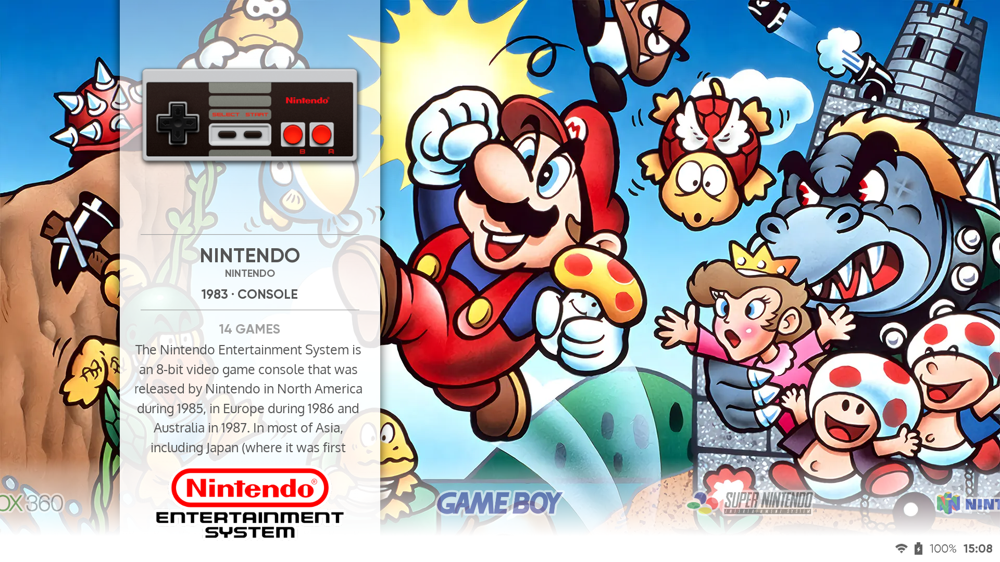
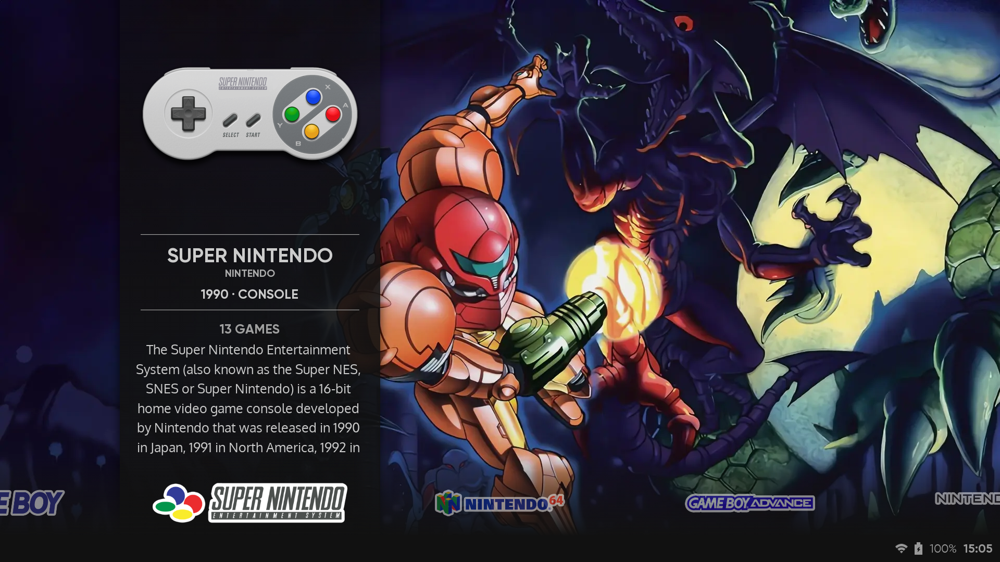
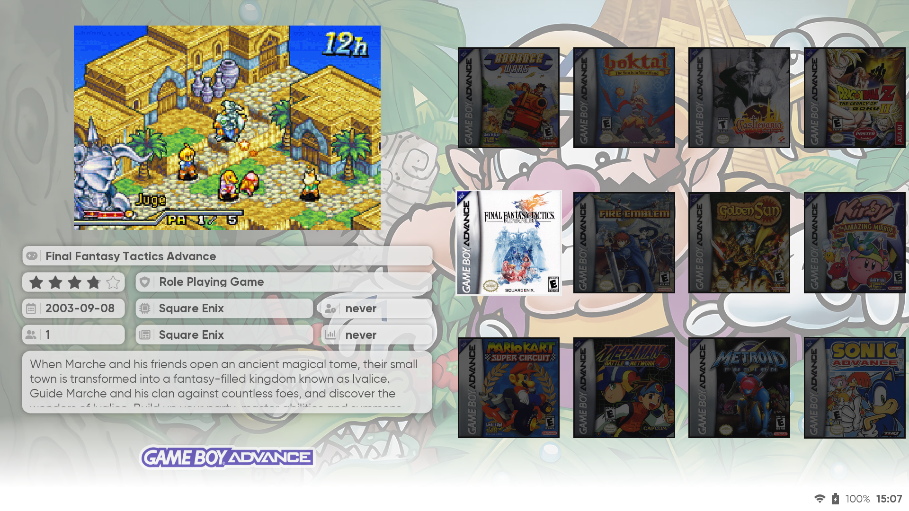
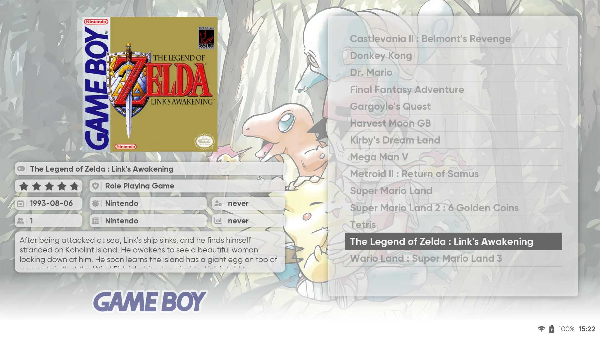
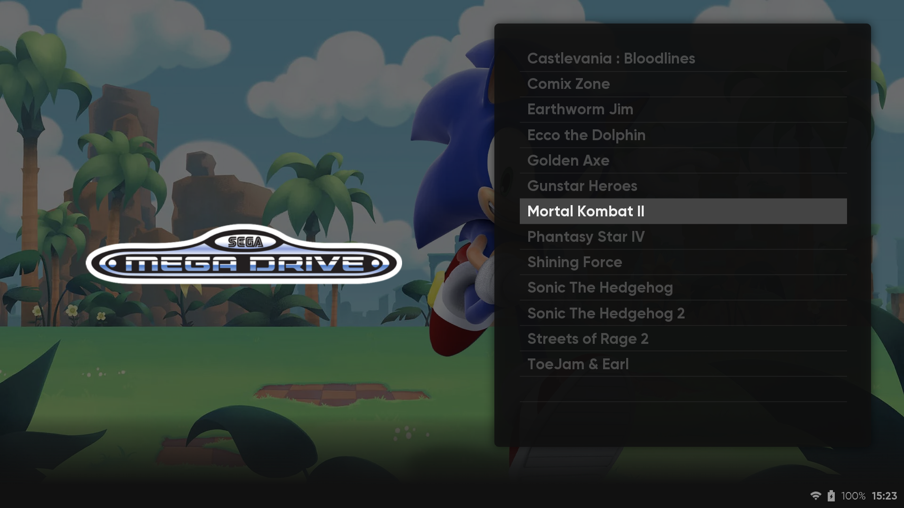

# Iconic (ES version)

**Iconic** is a theme for [EmulationStation](https://github.com/batocera-linux/batocera-emulationstation) (Batocera variant), based on [the ES-DE version](https://github.com/Siddy212/iconic-es-de) created by [@Siddy212](https://github.com/Siddy212).

## Preview

| Light Mode | Dark Mode|
| :--: | :--: |
|  |  |
|  |  |
|  |  |

## Installation

If your version of EmulationStation supports it, you can install this theme using [the integrated downloader](https://wiki.batocera.org/themes#emulationstation_themes) from the main menu under `Updates & Downloads > Theme`.

Otherwise, you can [download this theme](https://github.com/Delgan/iconic-es/archive/refs/heads/main.zip) and uncompress it the appropriate "themes" folder of your distribution.

## Configuration

The following options can be changed directly from the main menu under `User Interface Settings > Theme Configuration`

| Setting | Description | Options |
| -- | -- | -- |
| Color Scheme | Sets the color scheme that is used for the theme. | `Light`, `Dark` |
| Show Game Titles in Grid | Toggle the display of game titles in the grid view. | `Off`, `On` |
| Metadata Image Type | Select the desired type of image displayed above game details. | `Boxart`, `Image`, `Marquee`, `Mix` |
| Metadata Source | Select the primary source of metadata (name, release year, etc.) to associate with each systems. | `Theme`, `EmulationStation` |
| Distribution | Used to define which folder to look in for Theme Customization files (see below). | `None`, `Batocera/Knulli`, `Retrobat`, `RockNIX` |

## Customization

This theme allows customizations to artwork without the need to edit the source XML. This enables you to change the look of the theme and still retain any changes when the root theme is updated.

### Start Here

- Make sure the `Distribution` setting is set to the correct value for your current OS (e.g. Batocera/Knulli, RetroBat or Rocknix)
- This value determines the folder where you will add your customizations:
    - Batocera/Knulli = `/userdata/theme-customizations/iconic/`
    - RockNIX = `/roms/_userdata/theme-customizations/iconic/`
    - Retrobat = `C:\RetroBat\emulationstation\.emulationstation\theme-customizations\iconic\`
- Create the folders that match your distribution and then move on to the section below.

### Backgrounds

The artwork used on the system view can be customized with your own images.

* Create a new folder called `overlays` in the theme customizations directory mentioned above.
* Copy your custom background images to that folder.
* They should be named:
    - ${system.theme}.webp
* `${system.theme}.webp` should be named for the system you are looking to override.  For example if you wanted to override the artwork for `snes` you would create an image called `snes.webp` in the backgrounds folder.
* If a given ${system.theme}.webp image is not found, then the the built-in images from the theme will be used as a fallback. This allows you to customize only the images you want and still have images displayed for all systems.

## Acknowledgments

Inspiration and templates were taken from the following themes:

- [Iconic (ES-DE)](https://github.com/Siddy212/iconic-es-de) by [Siddy212](https://github.com/Siddy212).
- [Iconic (Batocera 4:3)](https://github.com/waffledork/iconic-batocera) by [waffledork](https://github.com/waffledork).
- [TechDweeb (ES)](https://github.com/anthonycaccese/techdweeb-es) by [anthonycaccese](https://github.com/anthonycaccese).

This theme would not have been possible without the dedicated work of numerous artists who created the artworks, including but not limited to:

- [fagnerpc](https://github.com/fagnerpc)
- [Robert Fink](https://finklematter.artstation.com/)
- [Mark Van Haitsma](https://www.artstation.com/mvhaitsma)
- [Yoshiyaki](https://www.deviantart.com/yoshiyaki)
- [Renato Giacomo](https://www.artstation.com/renatogiacomini)
- [Vincent Moubeche](https://www.artstation.com/vincentmoubeche)
- [SonicJeremy](https://www.deviantart.com/sonicjeremy)
- [Hydro-Plumber](https://www.deviantart.com/hydro-plumber)
- [Pik](https://gamebanana.com/members/1521238)
- [Nibroc-Rock](https://www.deviantart.com/nibroc-rock)
- [Blueamnesiac](https://www.deviantart.com/blueamnesiac)
- [Adverse56](https://www.deviantart.com/adverse56)
- [Chris Silva](https://www.artstation.com/artwork/obBlyB)
- [jlcryu](https://www.deviantart.com/jlcryu)
- [EliteRobo](https://www.deviantart.com/eliterobo)
- [mikimontllo](https://twitter.com/mikimontllo)
- [Scotsman](https://forums.launchbox-app.com/profile/142250-scotsman/)
- [PangolinWrestler](https://github.com/PangolinWrestler)
- [Luis Felipe Moura](https://www.artstation.com/luizmoura)
- [ZehB](https://www.deviantart.com/zehb)
